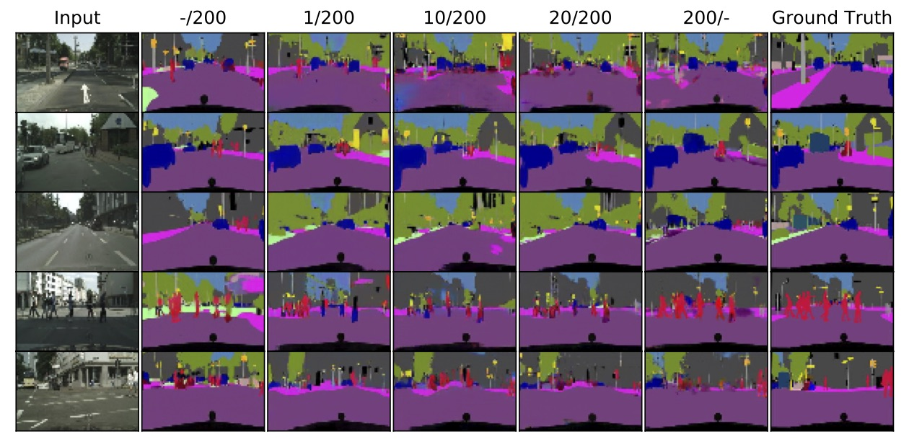

# Weakly-Supervised-I2I-Translation
Code for ["Extremely Weak Supervised Image-to-Image Translation for Semantic Segmentation"](https://arxiv.org/pdf/1909.08542.pdf)



## Introduction
Code to train I2I translation model using both paired and unpaired training samples.
This code builds on top of [pytorch-CycleGAN-and-pix2pix
](https://github.com/junyanz/pytorch-CycleGAN-and-pix2pix).

## Prerequisites
1. python 3.5.5
2. pytorch 0.4
3. visdom 0.1.7
4. dominate 2.3.1

## Pretrained models
1. [cityscapes_1](https://drive.google.com/drive/folders/1ZcsAklgGhIolt0o1J5DK_u8EpVt3ATuE?usp=sharing)
2. [cityscapes_10](https://drive.google.com/drive/folders/12MwLLWH-6LeTApZBx03NGbByD3O1F6vR?usp=sharing)
3. [cityscapes_20](https://drive.google.com/drive/folders/1_THJjWmWoM-63wSjVl3nPUDlZ_Y0FiLy?usp=sharing)

**Note**: Suffix indicates number of paired samples used. All models use 200 unpaired samples.

## Citation
If case you use this code for your research, please cite:

```
@article{shukla2019extremely,
  title={Extremely Weak Supervised Image-to-Image Translation for Semantic Segmentation},
  author={Shukla, Samarth and Van Gool, Luc and Timofte, Radu},
  journal={arXiv preprint arXiv:1909.08542},
  year={2019}
}

```
